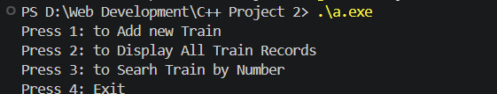
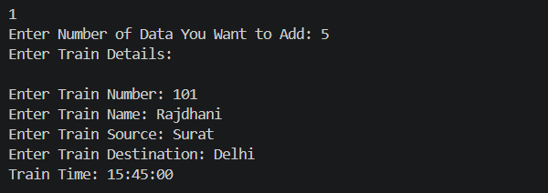
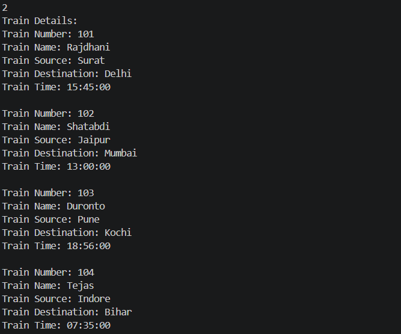
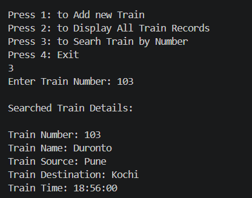
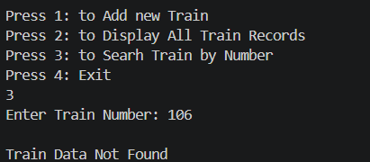

# Railway Reservation System

## Project Overview

The **Railway Reservation System** is a simple, menu-driven C++ console application for managing basic train records. It uses `Train` and `RailwaySystem` classes and stores train information in an array.

Each train record contains:
- Train number
- Train name
- Source station
- Destination station
- Train time

The program allows users to add train records, display all saved records, and search for a train using its train number.

### Main Menu

The main menu lets the user choose an operation: add a train, display all train records, search by train number, or exit the program.

---

## 1. Add New Train

This option lets the user enter how many train records they want to add. For each train, the program asks for the train number, name, source, destination, and time, then stores the details.

### Screenshot

---

## 2. Display All Train Records

This option displays the details of every train record currently stored in the system, including the train number, name, source, destination, and time.

### Screenshot

---

## 3. Search Train by Number

This option asks the user to enter a train number. If a matching record exists, the program displays that train's details.

### Screenshot

---

## 4. Train Record Not Found

If the entered train number does not match any stored record, the program displays a **"Train Data Not Found"** message.

### Screenshot

